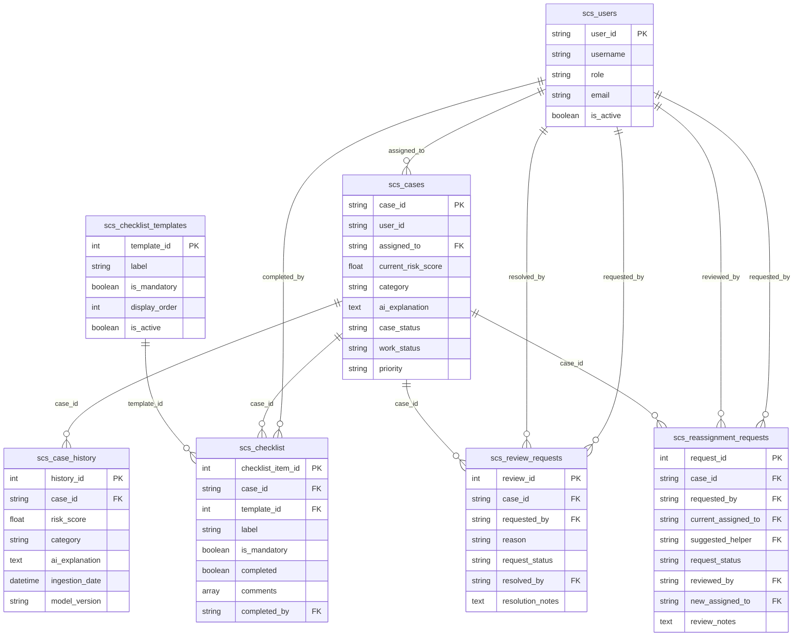
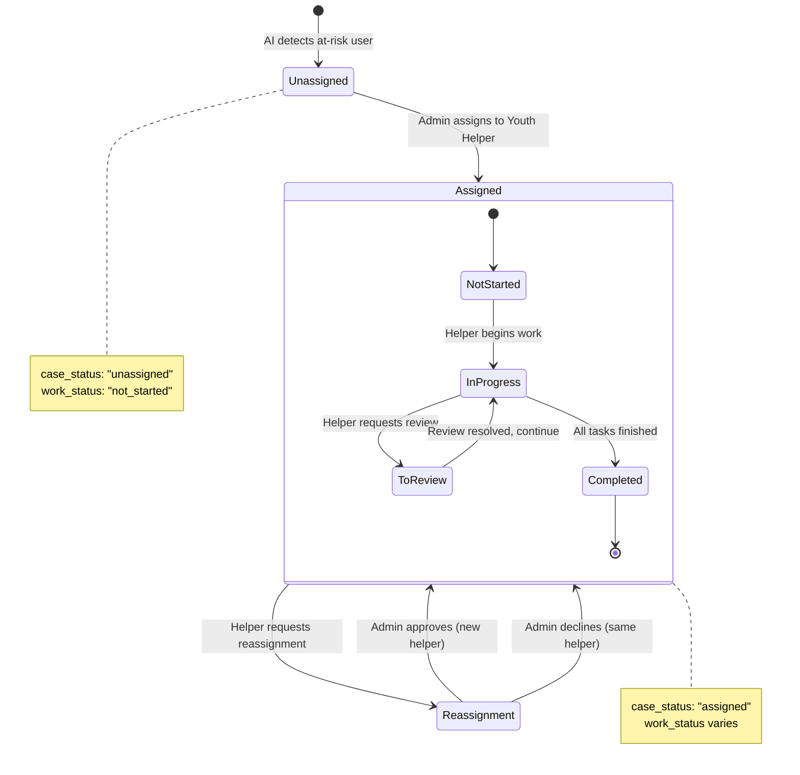
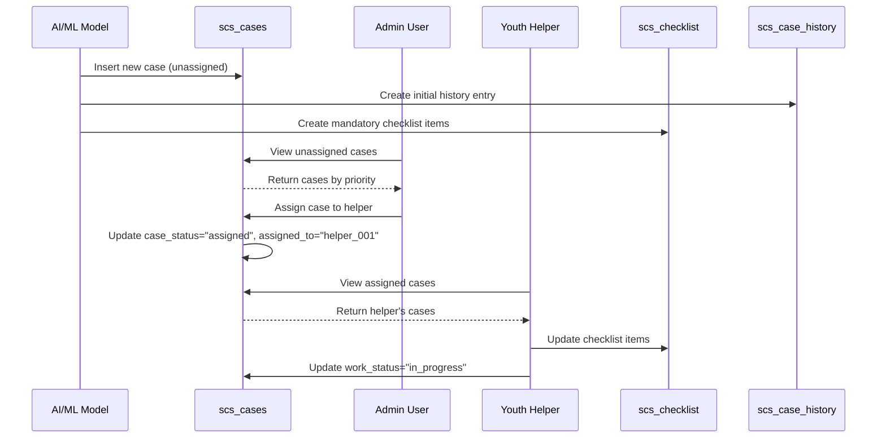
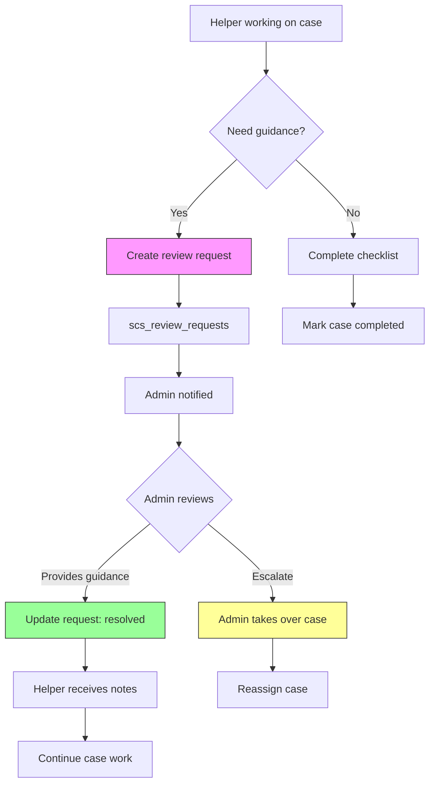
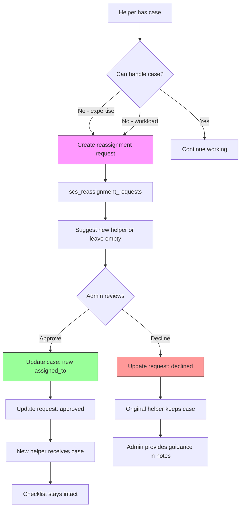
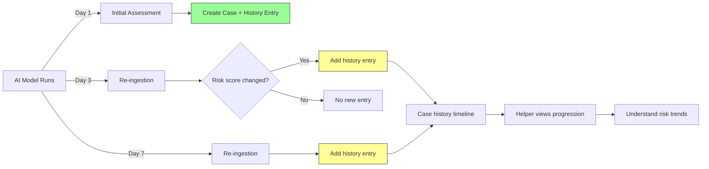
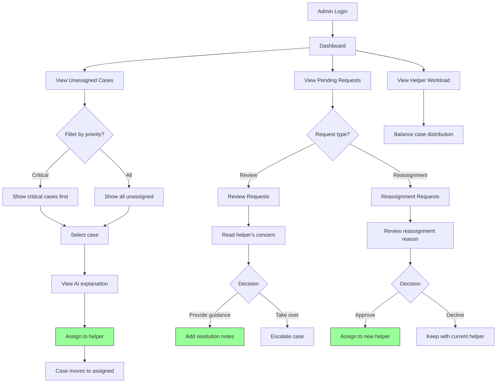
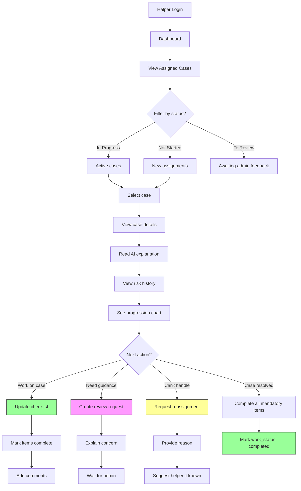
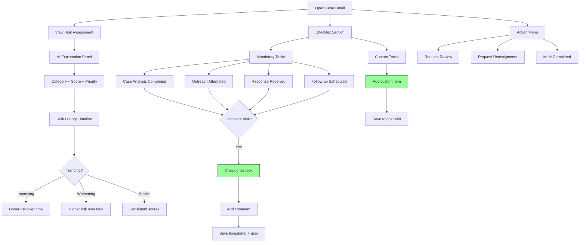

# SCS Youth Helper Dashboard - Database Architecture

## 📊 Overview

The SCS (Social Care Services) Youth Helper Dashboard uses MongoDB with 7 main collections to manage at-risk youth cases identified through AI analysis of social media behavior.

### Collections Summary

| Collection | Purpose | Key References |
|-----------|---------|----------------|
| `scs_users` | User accounts (admins & youth helpers) | Referenced by: cases, requests |
| `scs_cases` | Core case records with AI risk analysis | References: users |
| `scs_case_history` | Historical risk assessment snapshots | References: cases |
| `scs_checklist` | Task tracking per case | References: cases, templates, users |
| `scs_checklist_templates` | Standard mandatory tasks | Referenced by: checklist |
| `scs_review_requests` | Helper requests for admin guidance | References: cases, users |
| `scs_reassignment_requests` | Case reassignment requests | References: cases, users |
| `counters` | Auto-increment ID sequences | Internal utility |

---

## 🗂️ Collection Schemas

### 1. scs_users
**Purpose:** Store user accounts and authentication
```javascript
{
  user_id: "helper_001",              // Unique identifier (string)
  username: "Alex Johnson",            // Display name
  role: "youth_helper",                // "admin" or "youth_helper"
  email: "alex@example.com",          // Contact email
  is_active: true,                     // Account status
  created_at: ISODate("..."),
  updated_at: ISODate("...")
}
```

### 2. scs_cases
**Purpose:** Core case records with AI-generated risk assessments
```javascript
{
  case_id: "CASE_2026_001",           // Unique case identifier
  user_id: "@at_risk_teen_01",        // Social media handle being monitored
  assigned_to: "helper_001",          // References scs_users.user_id (nullable)
  current_risk_score: 78.5,           // 0-100 risk score from AI
  category: "Depression",              // AI-determined risk category
  ai_explanation: "Based on sentiment analysis...", // LLM-generated explanation
  case_status: "assigned",             // "unassigned" | "assigned"
  work_status: "in_progress",          // "not_started" | "in_progress" | "to_review" | "completed"
  priority: "high",                    // "low" | "medium" | "high" | "critical"
  created_at: ISODate("..."),
  updated_at: ISODate("...")
}
```

**Important:** The `ai_explanation` field contains the full LLM-generated risk analysis text, replacing the older structured `risk_summary` format.

### 3. scs_case_history
**Purpose:** Track risk score evolution over time
```javascript
{
  history_id: 1,                       // Auto-increment ID
  case_id: "CASE_2026_001",           // References scs_cases.case_id
  risk_score: 75.4,                    // Historical risk score
  category: "Depression",              // Historical category
  ai_explanation: "Early signs show...", // AI explanation at this point in time
  ingestion_date: ISODate("..."),     // When this assessment was made
  model_version: "v2.1.0"             // AI model version used
}
```

### 4. scs_checklist
**Purpose:** Track required and custom tasks per case
```javascript
{
  checklist_item_id: 1,                // Auto-increment ID
  case_id: "CASE_2026_001",           // References scs_cases.case_id
  template_id: 1,                      // References scs_checklist_templates.template_id (nullable for custom items)
  label: "Case Analysis Completed",    // Task description
  is_mandatory: true,                  // Required task?
  completed: false,                    // Task status
  comments: [                          // Array of comment objects
    {
      comment: "Initial analysis done",
      timestamp: "2026-03-01T10:30:00",
      by: "helper_001"                 // References scs_users.user_id
    }
  ],
  completed_at: ISODate("..."),
  completed_by: "helper_001",          // References scs_users.user_id
  display_order: 1,                    // UI ordering
  created_at: ISODate("...")
}
```

### 5. scs_checklist_templates
**Purpose:** Define standard mandatory tasks
```javascript
{
  template_id: 1,                      // Unique template ID
  label: "Case Analysis Completed",    // Task description
  is_mandatory: true,                  // Required for all cases?
  display_order: 1,                    // UI ordering
  is_active: true,                     // Template enabled?
  created_at: ISODate("...")
}
```

**Default Templates:**
1. Case Analysis Completed
2. Outreach Attempted
3. Response Received
4. Follow-up Scheduled

### 6. scs_review_requests
**Purpose:** Helper requests for admin guidance on difficult cases
```javascript
{
  review_id: 1,                        // Auto-increment ID
  case_id: "CASE_2026_007",           // References scs_cases.case_id
  requested_by: "helper_001",          // References scs_users.user_id
  reason: "Multiple risk factors...",  // Why review is needed
  request_status: "pending",           // "pending" | "resolved"
  requested_at: ISODate("..."),
  resolved_by: "admin_001",            // References scs_users.user_id (nullable)
  resolved_at: ISODate("..."),
  resolution_notes: "Approved..."      // Admin's guidance
}
```

### 7. scs_reassignment_requests
**Purpose:** Request to transfer case to different youth helper
```javascript
{
  request_id: 1,                       // Auto-increment ID
  case_id: "CASE_2026_010",           // References scs_cases.case_id
  requested_by: "helper_005",          // References scs_users.user_id
  current_assigned_to: "helper_005",   // Current case owner
  reason: "Requires specialized...",   // Reason for reassignment
  suggested_helper: "helper_003",      // Preferred new assignee (nullable)
  request_status: "pending",           // "pending" | "approved" | "declined"
  requested_at: ISODate("..."),
  reviewed_by: "admin_001",            // References scs_users.user_id (nullable)
  reviewed_at: ISODate("..."),
  new_assigned_to: "helper_003",       // Actual new assignee if approved
  review_notes: "Approved due to..."   // Admin's decision notes
}
```

---

## 🔗 Relationship Diagram



---

## 📈 Data Flow Diagrams

### Case Lifecycle Flow



### Case Assignment Process



### Review Request Workflow



### Reassignment Request Workflow



### Case History Tracking



---

## 👥 User Flow Diagrams

### Admin Dashboard Flow



### Youth Helper Dashboard Flow



### Case Work Detail Flow



---

## 🔄 Key Operations

### 1. New Case Creation (AI Model)

**Triggered by:** AI/ML model identifies at-risk social media user

**Operations:**
1. Insert into `scs_cases`:
   - Generate unique `case_id`
   - Set `case_status = "unassigned"`
   - Set `work_status = "not_started"`
   - Store `ai_explanation` (LLM-generated text)
   - Assign `priority` based on risk score

2. Insert into `scs_case_history`:
   - Create initial history entry with same AI explanation
   - Store `model_version` for tracking

3. Insert into `scs_checklist`:
   - Query `scs_checklist_templates` for active templates
   - Create checklist item for each mandatory template
   - Link via `case_id`

**Result:** Case appears in admin's unassigned queue

---

### 2. Case Assignment (Admin)

**Triggered by:** Admin assigns unassigned case to youth helper

**Operations:**
1. Update `scs_cases`:
   ```javascript
   db.scs_cases.updateOne(
     { case_id: "CASE_2026_001" },
     { 
       $set: { 
         assigned_to: "helper_001",
         case_status: "assigned",
         updated_at: new Date()
       }
     }
   )
   ```

2. **No changes** to `scs_checklist` - items persist
3. **No changes** to `scs_case_history` - history preserved

**Result:** Case appears in helper's dashboard

---

### 3. Checklist Update (Youth Helper)

**Triggered by:** Helper completes a task

**Operations:**
1. Update `scs_checklist`:
   ```javascript
   db.scs_checklist.updateOne(
     { 
       case_id: "CASE_2026_001",
       label: "Case Analysis Completed"
     },
     {
       $set: {
         completed: true,
         completed_at: new Date(),
         completed_by: "helper_001"
       },
       $push: {
         comments: {
           comment: "Initial analysis done",
           timestamp: new Date().toISOString(),
           by: "helper_001"
         }
       }
     }
   )
   ```

2. Optional: Update `scs_cases.work_status` if milestone reached

**Result:** Progress visible in case detail view

---

### 4. Review Request (Youth Helper)

**Triggered by:** Helper needs admin guidance on difficult case

**Operations:**
1. Insert into `scs_review_requests`:
   ```javascript
   db.scs_review_requests.insertOne({
     review_id: <next_id>,
     case_id: "CASE_2026_007",
     requested_by: "helper_001",
     reason: "Multiple risk factors, need guidance on escalation",
     request_status: "pending",
     requested_at: new Date()
   })
   ```

2. Update `scs_cases.work_status = "to_review"`

**Result:** Appears in admin's pending review queue

---

### 5. Review Resolution (Admin)

**Triggered by:** Admin provides guidance on review request

**Operations:**
1. Update `scs_review_requests`:
   ```javascript
   db.scs_review_requests.updateOne(
     { review_id: 1 },
     {
       $set: {
         request_status: "resolved",
         resolved_by: "admin_001",
         resolved_at: new Date(),
         resolution_notes: "Approved for emergency services escalation"
       }
     }
   )
   ```

2. Update `scs_cases.work_status = "in_progress"` (helper continues)

**Result:** Helper receives guidance and continues work

---

### 6. Reassignment Request (Youth Helper)

**Triggered by:** Helper cannot handle case due to expertise/workload

**Operations:**
1. Insert into `scs_reassignment_requests`:
   ```javascript
   db.scs_reassignment_requests.insertOne({
     request_id: <next_id>,
     case_id: "CASE_2026_010",
     requested_by: "helper_005",
     current_assigned_to: "helper_005",
     reason: "Requires specialized trauma training",
     suggested_helper: "helper_003",  // Optional
     request_status: "pending",
     requested_at: new Date()
   })
   ```

**Result:** Awaits admin approval/denial

---

### 7. Reassignment Approval (Admin)

**Triggered by:** Admin approves reassignment request

**Operations:**
1. Update `scs_cases`:
   ```javascript
   db.scs_cases.updateOne(
     { case_id: "CASE_2026_010" },
     {
       $set: {
         assigned_to: "helper_003",  // New helper
         updated_at: new Date()
       }
     }
   )
   ```

2. Update `scs_reassignment_requests`:
   ```javascript
   db.scs_reassignment_requests.updateOne(
     { request_id: 1 },
     {
       $set: {
         request_status: "approved",
         reviewed_by: "admin_001",
         reviewed_at: new Date(),
         new_assigned_to: "helper_003",
         review_notes: "Approved - Case requires trauma specialist"
       }
     }
   )
   ```

3. **Checklist preserved** - new helper sees all existing progress

**Result:** Case transferred to new helper with full history intact

---

### 8. AI Re-ingestion (Scheduled)

**Triggered by:** AI model re-analyzes user (e.g., daily/weekly)

**Operations:**
1. Query `scs_cases` for existing case:
   ```javascript
   const existingCase = db.scs_cases.findOne({ user_id: "@at_risk_teen_01" })
   ```

2. Update `scs_cases` if risk changed:
   ```javascript
   db.scs_cases.updateOne(
     { case_id: "CASE_2026_001" },
     {
       $set: {
         current_risk_score: 82.3,  // New score
         category: "Depression",     // May change
         ai_explanation: "Worsening symptoms detected...",  // New AI analysis
         updated_at: new Date()
       }
     }
   )
   ```

3. Insert into `scs_case_history`:
   ```javascript
   db.scs_case_history.insertOne({
     history_id: <next_id>,
     case_id: "CASE_2026_001",
     risk_score: 82.3,
     category: "Depression",
     ai_explanation: "Worsening symptoms detected...",
     ingestion_date: new Date(),
     model_version: "v2.1.0"
   })
   ```

**Result:** Helper sees risk progression, can adjust intervention strategy

---

## 🔍 Common Queries

### Get all unassigned critical cases
```javascript
db.scs_cases.find({
  case_status: "unassigned",
  priority: "critical"
}).sort({ current_risk_score: -1 })
```

### Get helper's active cases with priority
```javascript
db.scs_cases.find({
  assigned_to: "helper_001",
  work_status: { $in: ["not_started", "in_progress", "to_review"] }
}).sort({ priority: 1, current_risk_score: -1 })
```

### Get case with full history
```javascript
// Get case
const case = db.scs_cases.findOne({ case_id: "CASE_2026_001" })

// Get history timeline
const history = db.scs_case_history.find({ 
  case_id: "CASE_2026_001" 
}).sort({ ingestion_date: 1 })
```

### Get case checklist completion status
```javascript
db.scs_checklist.aggregate([
  { $match: { case_id: "CASE_2026_001" } },
  { $group: {
      _id: "$case_id",
      total: { $sum: 1 },
      completed: { $sum: { $cond: ["$completed", 1, 0] } },
      mandatory: { $sum: { $cond: ["$is_mandatory", 1, 0] } },
      mandatory_completed: { 
        $sum: { $cond: [{ $and: ["$is_mandatory", "$completed"] }, 1, 0] }
      }
  }}
])
```

### Get all pending admin actions
```javascript
// Pending reviews
const reviews = db.scs_review_requests.find({ request_status: "pending" })

// Pending reassignments
const reassignments = db.scs_reassignment_requests.find({ request_status: "pending" })
```

### Get helper workload summary
```javascript
db.scs_cases.aggregate([
  { $match: { case_status: "assigned" } },
  { $group: {
      _id: "$assigned_to",
      total_cases: { $sum: 1 },
      critical: { $sum: { $cond: [{ $eq: ["$priority", "critical"] }, 1, 0] } },
      high: { $sum: { $cond: [{ $eq: ["$priority", "high"] }, 1, 0] } },
      avg_risk: { $avg: "$current_risk_score" }
  }},
  { $lookup: {
      from: "scs_users",
      localField: "_id",
      foreignField: "user_id",
      as: "helper_info"
  }}
])
```

---

## 📌 Key Design Principles

### 1. Referential Integrity via String IDs
- Uses string-based foreign keys (`user_id`, `case_id`) for flexibility
- No MongoDB native references, but relationships enforced at application layer
- Allows for easier debugging and manual queries

### 2. Temporal Data Preservation
- **Never delete** case history entries
- History provides timeline for understanding risk progression
- Helpers can see if risk is improving, worsening, or stable

### 3. Checklist Persistence Through Reassignment
- Checklist items **remain intact** when case is reassigned
- New helper sees all previous work and comments
- Ensures continuity of care

### 4. AI Explanation Architecture
- **Schema evolution**: Moved from structured `risk_summary` JSON to `ai_explanation` text
- AI explanation stored in both `scs_cases` (current) and `scs_case_history` (historical)
- Allows LLM to provide nuanced, context-rich explanations

### 5. Request-Based Workflows
- Helpers don't directly modify critical case properties
- Review and reassignment go through admin approval
- Audit trail via request collections

### 6. Auto-increment IDs via Counters
- MongoDB doesn't provide auto-increment by default
- Uses `counters` collection with `find_one_and_update`
- Ensures unique sequential IDs for history, checklist, and requests

---

## 🚀 Data Migration Notes

### From SQL to MongoDB
Original SQL schema used:
- Foreign keys with `ON DELETE RESTRICT`
- Triggers for auto-history creation
- Views for aggregated data

MongoDB approach:
- String-based references (enforced in application)
- Explicit history creation in seed scripts
- Aggregation pipelines instead of views

### Schema Updates
- **Old schema:** `current_category`, `current_risk_signals` (simple strings)
- **Intermediate:** `risk_categories` array, `risk_summary` (structured JSON)
- **Current:** `category` (string), `ai_explanation` (LLM text)

Running `updated_seed.py` will:
- ✅ Replace `scs_cases` with new schema
- ✅ Replace `scs_case_history` with new schema
- ✅ Recreate `scs_checklist` (new case_ids)
- 🔒 Preserve `scs_users`, `scs_checklist_templates`, `scs_review_requests`, `scs_reassignment_requests`

---

## 📚 Related Documentation

- [QUICK_START.md](../QUICK_START.md) - Setup instructions
- [MCP_SETUP_COMPLETE.md](../MCP_SETUP_COMPLETE.md) - MCP service configuration
- [scs_seed.py](./scs_seed.py) - Original seed script
- [updated_seed.py](./updated_seed.py) - Current seed script with AI explanations

---

**Last Updated:** March 1, 2026  
**Database:** MongoDB Atlas - `dellinnovate`  
**Collections:** 7 main + 1 utility (counters)
